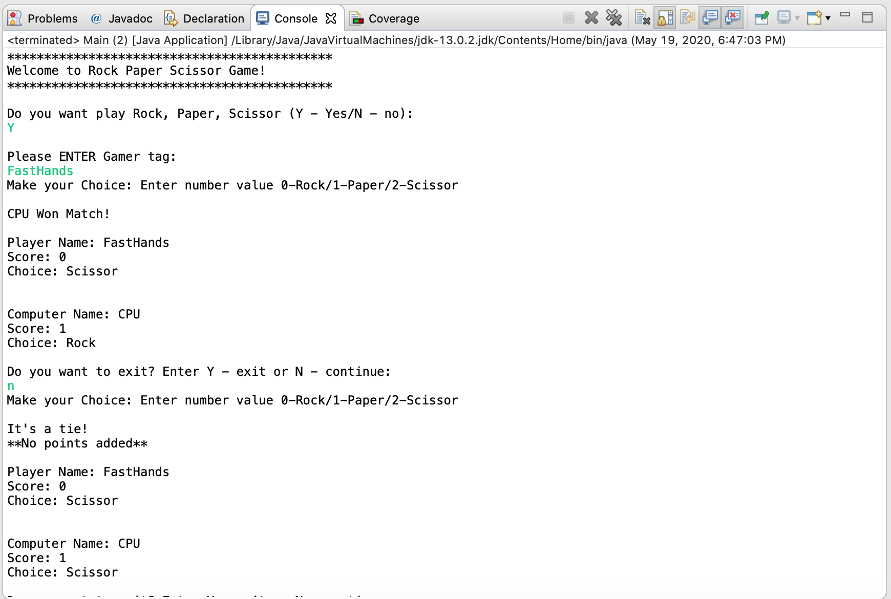

# Rock-Paper-Scissor-Java-Game
Rock paper scissors java game simulates the hand game usually played between two people, in which each player simultaneously forms one of three shapes with an outstretched hand. These shapes are "rock", "paper", and "scissors". This is a player vs cpu java game. 

Game Rules: 
A player who decides to play rock will beat another player who has chosen scissors ("rock crushes scissors"), but will lose to one who has played paper ("paper covers rock"); a play of paper will lose to a play of scissors ("scissors cuts paper"). If both players choose the same shape, the game is tied and not points are given. 1 point is given to the match winner and the game is over when one of the players gets a score of ten. The player gets the opporuntity to quit the game after each match. 

{:height="50%" width="50%"}
{:height="50%" width="50%"}
